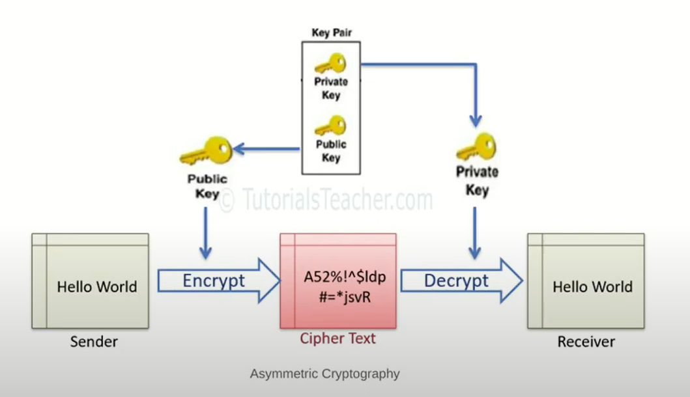
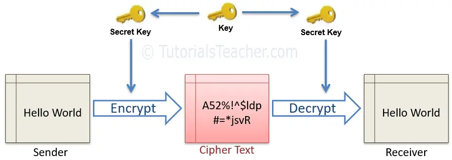
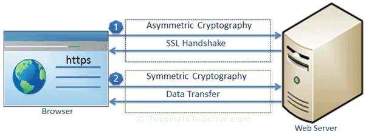

SSL hoạt động như thế nào?
- Tham khảo [tại đây](https://www.tutorialsteacher.com/https/how-ssl-works)

1. Mã hóa bất đối xứng (Asymmetric Cryptography) là gì? 

    + Là kiểu mã hóa sử dụng một cặp khóa bao gồm Public Key và Private Key
    + Public Key được sử dụng trong quá trình mã hóa thông tin (Encrypt)
    + Private Key được sử dụng trong quá trình giải mã thông tin (Decrypt)
    + Thường sử dụng các thuật toán mã hóa như: EIGamal, RSA, DSA, Elliptic và PKCS.

2. Mã hóa đối xứng (Symmetric Cryptography) là gì?

    + Là kiểu mã hóa chỉ sử dụng một khóa (Private Key) trong quá trình mã hóa (Encrypt) cũng như giải mã thông tin (Decrypt)
    + Thường sử dụng các thuật toán mã hóa như: AES-128, AES-192 và AES-256

3. Quá trình truyền tải dữ liệu thông qua SSL như thế nào?

+ Bước 1. SSL Handshake 
    - Tương ứng với nó là thuật toán mã hóa đối xứng (Asymmetric) sẽ được sử dụng trong quá trình này
...

Public Key Infrastructure
The public key infrastructure (PKI) is a set of roles, policies, and procedures needed to create, manage, distribute, use, store, and revoke digital certificates and manage public key encryption.

PKI includes the following elements:

Certificate Authority: The authority that authenticates the identity of individuals, computers and other entities.
Registration Authority: A subordinate CA that issues a certificate on the behalf of root CA for specific uses.
SSL Certificate: The Data file that includes the public key and other information.
Certificate Management System: The system which stores, validates and revokes certificates.

